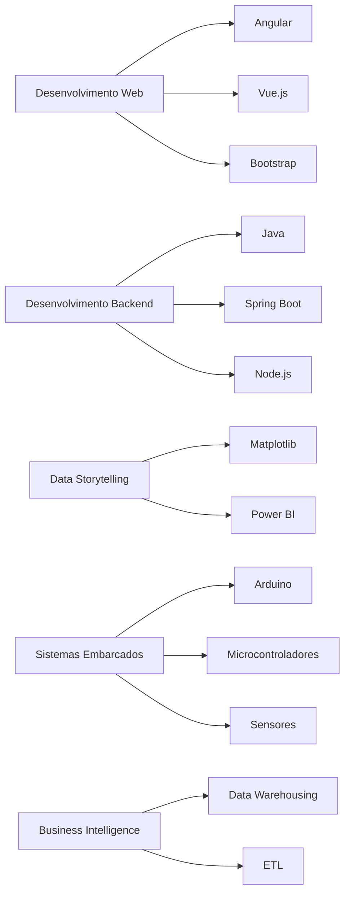

# Frederico Enzo Pinheiro Peiter!

### 🚀 Áreas de Interesse
- Desenvolvimento Web (Angular, Vue.js, Bootstrap)
- Desenvolvimento Backend (Java, Spring Boot, Node.js)
- Data Storytelling e Visualização de Dados (Matplotlib, Power BI)
- Sistemas Embarcados (Arduino, Microcontroladores, Sensores)
- Business Intelligence (Data Warehousing, ETL)

### 🛠️ Tecnologias e Ferramentas

### 🌍 Vamos nos Conectar
- **LinkedIn:** [Frederico Enzo](https://www.linkedin.com/in/frederico-enzo)
- **E-mail:** frederico.enzo@example.com
- **Portfólio:** [Meu Site](https://frederico-enzo-portfolio.com)

---

### 📊 Gráficos de Habilidades

#### Linguagens de Programação

#### Ferramentas e Frameworks

#### Áreas de Interesse

